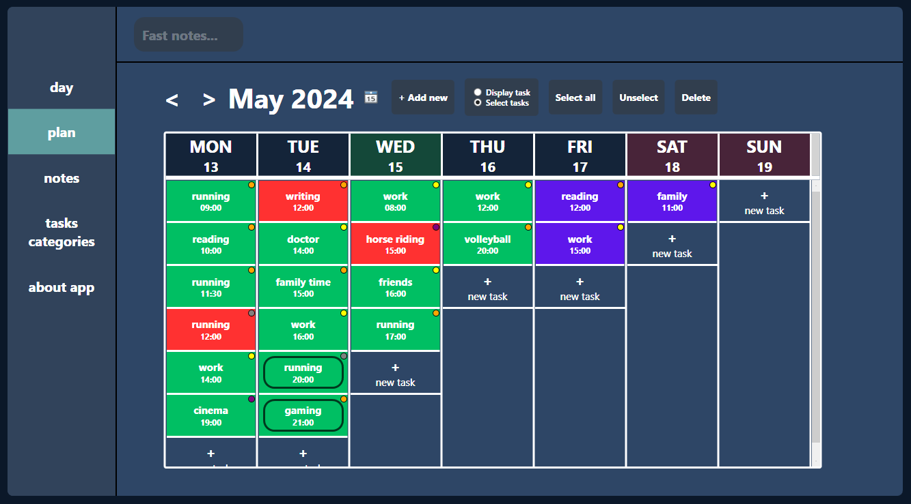

# engineering-thesis

## Project for task tracking, note taking and mood control. It's a self-development application that can help you control your daily basis.
### You can browse here:
* project files with the app code (SelfDevelopmentApplication directory)
* the original PDF of my thesis (in Polish)
* my summary (PDF presentation in English)
* my conclusions (in English)
### You can also run the app by running SelfDevelopmentApplication.exe file (SelfDevelopmentApplication directory).
### Used technologies:
* .NET 5
* WPF (C#, XAML)
* EF Core 5
* SQLite
* Xaml.Behaviors.WPF library
### Special thanks are due to the author of the Payload channel on YouTube, who posted quality guides on implementing the MVVM pattern in WPF for a modern, minimalistic interface, which the author of this work satisfactorily used during the initial work on the application.